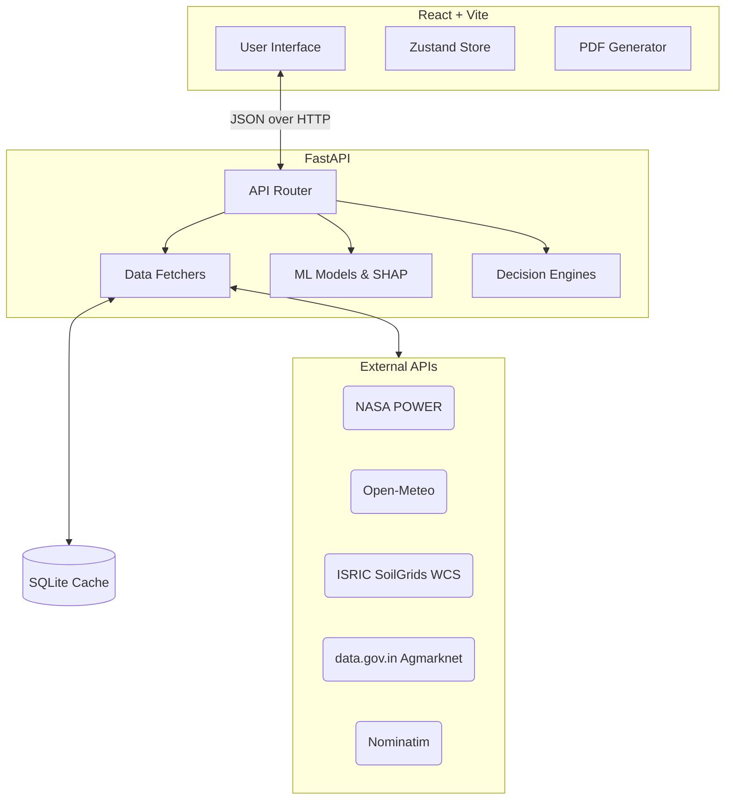

# KRISHIMITRA: AI-Powered Agricultural Decision Support System

<p align="center">
  
</p>

## Overview

KRISHIMITRA is a full-scale AI-powered Agricultural Decision Support System (ADSS) designed to deliver professional agronomic insights. It synthesizes geospatial, meteorological, and pedological data pipelines into a low-latency ensemble architecture, providing explainable crop advisories, yield predictions, and dynamic irrigation schedules.

## V2 Features

- **Farm Profile**: Configurable farm details (location, area, crop).
- **Data Engineering Pipeline**: Robust ingestion from NASA POWER, Open-Meteo, ISRIC SoilGrids WCS, and FAOSTAT with proper validation, caching, and error handling.
- **Crop Recommendation**: XGBoost classification model predicting the most suitable crop based on N, P, K, pH, rainfall, temp, and humidity.
- **Yield Prediction**: XGBoost regression model estimating historical and future yield trajectories (t/ha).
- **Explainable AI (XAI)**: SHAP-powered feature importance charts explaining *why* a crop was recommended.
- **Irrigation & Risk Advisory**: Heuristic-based engines combining expected rainfall, temperature, and soil conditions to output actionable advice.
- **Canonical recommendation**: One backend summary (`/api/farm/summary`) feeds every page, so Dashboard, Crop Advisor, Yield, AI Insights and Reports always agree. Overall = 60% agronomic + 40% financial, restricted to crops sowable in the next 60 days.
- **Live notifications**: Alerts are evaluated from the current data (IMD heavy-rain thresholds, heat/frost, irrigation threshold, crop/soil constraints, mandi price changes, source outages), deduplicated per farm location.
- **PDF reports**: Generated in the browser from the live summary (jsPDF), with a source-status table on every report.
- **Data transparency**: Settings → Data Sources & Provenance shows every source's real status, last successful fetch, fallback use and raw payload, with refresh/retry.
- **UI**: React + Vite + Tailwind, following the Stitch design system.

## Architecture

The system operates via a decoupled frontend-backend architecture. 



### Directory Structure

```text
KrishiMitra-ADSS/
├── api/                     # FastAPI backend application
├── src/                     # Backend core logic
│   ├── data/                # API clients (NASA, OpenMeteo, ISRIC, Agmarknet)
│   ├── features/            # Feature engineering pipelines
│   ├── models/              # ML training & inference logic
│   ├── advisory/            # Decision engines (Irrigation, Risk)
│   └── explainability/      # SHAP integration
├── data/                    # Local CSV datasets & DBs
├── frontend/                # React Vite application
├── models/                  # Pickled ML models & metrics
├── v1/                      # Original V1 preserved code
└── requirements.txt         # Python Dependencies
```

## Datasets & Provenance

| Dataset Source | Modality | Target Use | Access Method |
|---|---|---|---|
| **Open-Meteo API** | Meteorological | Current conditions, 7-day forecast, FAO-56 ET₀, modelled soil moisture | Live REST API |
| **NASA POWER API** | Meteorological | 5-year monthly climatology → crop-specific growing-season climate | Live REST API |
| **ISRIC SoilGrids v2.0** | Pedological | Soil pH, USDA texture, sand/silt/clay, OC, total N, CEC (250m resolution) | Live WCS API |
| **Agmarknet (data.gov.in)**| Market | Current daily mandi modal prices, local district or nearest market | Live REST API |
| **OSM Nominatim** | Geocoding | District/state resolution for market matching | Live REST API |
| **FAOSTAT** | Historical | National yields; yield-model training (local sample) | Offline CSV |
| **Crop recommendation**| Agronomic | crop_xgb training data | Offline CSV |

## Installation & Setup

1. Clone the repository.
2. Install dependencies:
   ```bash
   pip install -r requirements.txt
   ```
3. Set up environment variables by creating a `.env` file in the root directory. Required format:
   ```env
   # KrishiMitra Configuration
   
   # Agmarknet mandi prices (data.gov.in). Without a key the public sample key is used,
   # which returns at most 10 records per call and is quickly rate-limited (HTTP 429).
   # Register for a free personal key at https://data.gov.in and set it here.
   DATA_GOV_IN_API_KEY=""
   
   # Where runtime state (source health, market observations, geocode cache) is stored.
   KRISHIMITRA_STATE_DB="data/krishimitra_state.sqlite"
   
   # Frontend: backend URL used by the React app (Vite reads VITE_* variables).
   VITE_API_BASE="http://localhost:8000"
   
   # Application Settings
   ENVIRONMENT="development"
   LOG_LEVEL="INFO"
   ```
4. Train models (Optional, pre-trained provided):
   ```bash
   python -m src.models.train
   ```
5. Run the backend (from the repository root):
   ```bash
   python -m uvicorn api.main:app --reload
   ```
6. Run the frontend:
   ```bash
   cd frontend && npm install && npm run dev
   ```
   Open http://localhost:5173 and choose a location.

## Limitations & Ethical Considerations

- **Experimental AI**: Predictions are based on historical ML models and are intended for decision support, not absolute agronomic guarantees.
- **Data Fallbacks**: If external APIs are unavailable, the system gracefully handles missing values and informs the user rather than hallucinating measurements.
- **Yield Ranges**: Yield predictions represent an estimated statistical trajectory rather than a guaranteed output.
- **Market data**: The public data.gov.in sample key is heavily rate-limited; without a personal key, prices may fall back to the last observed Agmarknet price.

## License

MIT License
