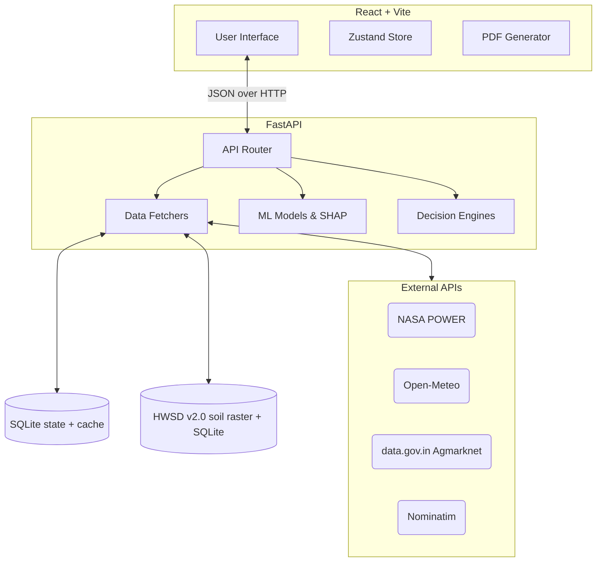

# KRISHIMITRA: AI-Powered Agricultural Decision Support System

<p align="center">
  
</p>

## Overview

KRISHIMITRA is a full-scale AI-powered Agricultural Decision Support System (ADSS) designed to deliver professional agronomic insights. It synthesizes geospatial, meteorological, and pedological data pipelines into a low-latency ensemble architecture, providing explainable crop advisories, yield predictions, and dynamic irrigation schedules.

## V2 Features

- **Farm Profile**: Configurable farm details (location, area, crop).
- **Data Engineering Pipeline**: Robust ingestion from NASA POWER, Open-Meteo, Agmarknet and Nominatim, plus local FAO/IIASA HWSD v2.0 soil data and FAOSTAT, with validation, caching, retry/back-off and per-source health tracking.
- **Crop Recommendation**: Agronomic rules engine (`src/advisory/crop_rules.py`) scoring 12 crops against their preferred N, P, K, pH, seasonal rainfall, temperature and humidity ranges and the Indian sowing calendar. Each factor outside its range multiplies the score down; every factor is attributed to its data source.
- **ML opinion**: An XGBoost classifier (`crop_xgb`, 22 crops, trained on the 2,200-row Kaggle crop-recommendation dataset) gives a second opinion in Crop Advisor: its top 5 crops with probabilities and whether it agrees with the rules engine. It never changes the recommendation. With a soil test it uses all 7 inputs (98.9 % hold-out accuracy); without one it uses temperature, humidity, pH and rainfall (94.1 %). Climate inputs are 5-year NASA POWER means over the current month and the next three; rainfall is the monthly mean, matching the dataset's scale.
- **Yield Prediction**: XGBoost regressor (`yield_xgb`) for crops present in the FAOSTAT sample (Rice, Wheat), shown with its hold-out error and reliability; other crops use a labelled reference yield × agronomic suitability.
- **Explainable AI (XAI)**: Per-factor attribution explains *why* a crop was ranked where it is; SHAP values explain the yield model's predictions.
- **Irrigation & Risk Advisory**: Heuristic-based engines combining expected rainfall, temperature, and soil conditions to output actionable advice.
- **Canonical recommendation**: One backend summary (`/api/farm/summary`) feeds every page, so Dashboard, Crop Advisor, Yield, AI Insights and Reports always agree. A crop is eligible when its sowing window is open or opens within 60 days, its agronomic suitability is at least 40 % and at least 2 factors could be evaluated. Crops are ranked by eligibility, then agronomic suitability, then net return per hectare (observed mandi prices only); the most profitable eligible crop is reported separately as the economic trade-off.
- **Live notifications**: Alerts are evaluated from the current data (IMD heavy-rain thresholds, heat/frost, irrigation threshold, crop/soil constraints, mandi price changes, source outages), deduplicated per farm location.
- **PDF reports**: Generated in the browser from the live summary (jsPDF), with a source-status table on every report.
- **Data transparency**: Settings → Data Sources & Provenance shows every source's real status, last successful fetch, fallback use and raw payload, with refresh/retry.
- **Model cards ("i" buttons)**: Every panel driven by a model or rule engine has an info button that opens its card (`/api/models`): why the approach was chosen, how it works, dataset collection method, split, classes and categories, evaluation metrics and limitations.
- **UI**: React + Vite + Tailwind, following the Stitch design system.

## Architecture

The system operates via a decoupled frontend-backend architecture. 



### Directory Structure

```text
KrishiMitra-ADSS/
├── api/                     # FastAPI backend application
├── src/                     # Backend core logic
│   ├── data/                # API clients (Open-Meteo, NASA POWER, Agmarknet, Nominatim), HWSD lookup, SQLite store
│   ├── features/            # Feature engineering for model training
│   ├── models/              # ML training, inference, yield service (incl. SHAP)
│   ├── advisory/            # Decision engines (crop rules, irrigation, risk, soil)
│   └── services/            # farm_summary: builds the canonical summary
├── scripts/hwsd/            # One-time build of the local HWSD v2.0 soil database
├── tests/                   # pytest suite
├── data/                    # Local CSV datasets & DBs
├── frontend/                # React Vite application
├── models/                  # Pickled ML models & metrics
├── v1/                      # Original V1 preserved code
└── requirements.txt         # Python Dependencies
```

## Datasets & Provenance

| Dataset Source | Modality | Target Use | Access Method |
|---|---|---|---|
| **Open-Meteo API** | Meteorological | Current conditions, 7-day forecast, FAO-56 ET₀, modelled soil moisture | Live REST API |
| **NASA POWER API** | Meteorological | 5-year monthly climatology → crop-specific growing-season climate | Live REST API |
| **FAO/IIASA HWSD v2.0** | Pedological | Topsoil pH, USDA texture, sand/silt/clay, OC, total N, CEC (~1 km, 0–20 cm) | Local raster + SQLite |
| **Agmarknet (data.gov.in)**| Market | Current daily mandi modal prices, local district or nearest market | Live REST API |
| **OSM Nominatim** | Geocoding | District/state resolution for market matching | Live REST API |
| **FAOSTAT** | Historical | National yields; yield-model training (19-row local sample) | Offline CSV |
| **Crop recommendation** ([Kaggle](https://www.kaggle.com/datasets/atharvaingle/crop-recommendation-dataset)) | Agronomic | crop_xgb training data (2,200 rows, 22 crops) | Offline CSV |

## Model Evaluation

Metrics are computed by `python -m src.models.train`, saved in `models/*_meta.json` and shown in the app's model cards.

**Crop classifier (`crop_xgb`)**: stratified 80/20 split (1,760 train / 440 test rows, 20 per crop, `random_state=42`) plus stratified 5-fold cross-validation. Precision, recall and F1 are macro averages over the 22 crops; with balanced classes the weighted averages are the same.

| Variant | Inputs | Accuracy | Precision | Recall | F1 | 5-fold CV accuracy |
|---|---|---|---|---|---|---|
| Full (soil test) | N, P, K, temperature, humidity, pH, rainfall | 98.9 % | 98.9 % | 98.9 % | 98.8 % | 99.3 % ± 0.3 |
| Climate + pH | temperature, humidity, pH, rainfall | 94.1 % | 94.2 % | 94.1 % | 94.0 % | 95.8 % ± 0.5 |

Per-crop precision, recall, F1 and the full 22 × 22 confusion matrix are in `models/crop_meta.json` and the Crop classifier model card. Weakest crops: lentil (full, recall 85 %), pomegranate and orange (climate, F1 81–82 %).

**Yield regressor (`yield_xgb`)**: random 80/20 split of the FAOSTAT sample (15 train / 4 test rows). MAE 0.031 t/ha, RMSE 0.047 t/ha, R² −5.33. Precision, recall and F1 do not apply to regression. Three of the four test rows are placeholder values, so these numbers say little about real accuracy.

**Rules engine, irrigation, soil and risk logic**: no labelled ground truth exists, so accuracy, precision, recall and F1 cannot be computed. Their behaviour is covered by unit tests in `tests/test_core.py`.

## Installation & Setup

1. Clone the repository.
2. Install dependencies:
   ```bash
   pip install -r requirements.txt
   ```
3. Set up environment variables by creating a `.env` file in the root directory. Required format:
   ```env
   # KrishiMitra Configuration
   
   # Agmarknet mandi prices (data.gov.in). Without a key the public sample key is used,
   # which returns at most 10 records per call and is quickly rate-limited (HTTP 429).
   # Register for a free personal key at https://data.gov.in and set it here.
   DATA_GOV_IN_API_KEY=""
   
   # Where runtime state (source health, market observations, geocode cache) is stored.
   KRISHIMITRA_STATE_DB="data/krishimitra_state.sqlite"
   
   # Frontend: backend URL used by the React app (Vite reads VITE_* variables).
   VITE_API_BASE="http://localhost:8000"
   
   # Application Settings
   ENVIRONMENT="development"
   LOG_LEVEL="INFO"
   ```
4. Build the local HWSD v2.0 soil database (one time). Download `HWSD2_RASTER.zip` and `HWSD2_DB.zip` from the [FAO HWSD page](https://www.fao.org/land-water/resources/tools/databases/hwsd/en), extract them into `data/hwsd/raw/`, then run:
   ```bash
   powershell -File scripts/hwsd/export_mdb.ps1
   python scripts/hwsd/build_hwsd.py
   ```
   Without it, soil data is reported as unavailable and the rest of the app still works.
5. Train models (Optional, pre-trained provided):
   ```bash
   python -m src.models.train
   ```
6. Run the backend (from the repository root):
   ```bash
   python -m uvicorn api.main:app --reload
   ```
7. Run the frontend:
   ```bash
   cd frontend && npm install && npm run dev
   ```
   Open http://localhost:5173 and choose a location.

## Limitations & Ethical Considerations

- **Experimental AI**: Recommendations come from a transparent rules engine and are intended for decision support, not absolute agronomic guarantees.
- **ML opinion**: The crop classifier is trained on a public benchmark dataset that is not specific to any region, and its classes separate so cleanly that probabilities are often near 100 %. Only 2 of its 22 crops (mung bean, black gram) are among the 12 the rules engine evaluates, so the two are often not directly comparable. It is shown for comparison only.
- **Yield sample data**: `faostat_sample.csv` has 19 rows and the yield model's hold-out R² is negative, so its estimates are marked low reliability. A full FAOSTAT export and re-running `python -m src.models.train` is required before the yield model carries real weight.
- **Data Fallbacks**: If external APIs are unavailable, the system gracefully handles missing values and informs the user rather than hallucinating measurements.
- **Yield Ranges**: Yield predictions represent an estimated statistical trajectory rather than a guaranteed output.
- **Market data**: The public data.gov.in sample key is heavily rate-limited; without a personal key, prices may fall back to the last observed Agmarknet price.

## License

MIT License
